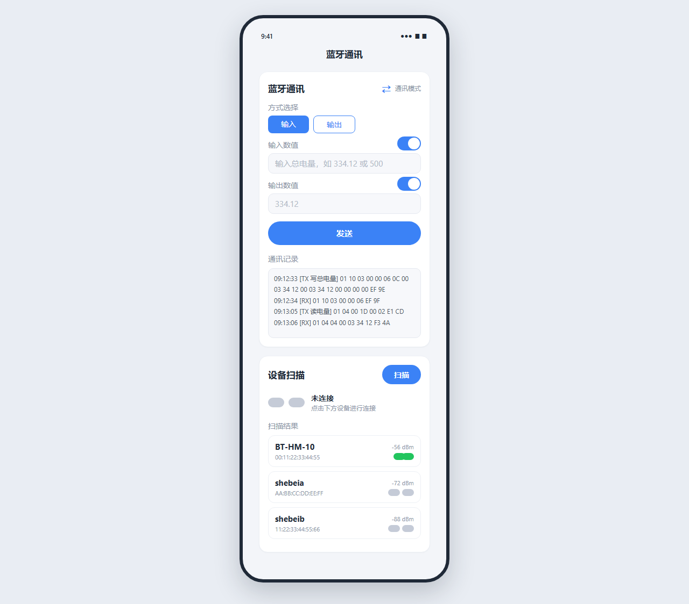

# BluetoothComm

基于 .NET MAUI 的蓝牙通讯 App，支持 Android / iOS，用于与 BLE 串口透传设备进行 Modbus RTU 指令收发。

## 功能特性

### 蓝牙通讯（上半部分）
- **输入（写总电量）**：点击发送 `0x10` 写帧，输入数值自动 BCD 编码 + CRC16 校验
- **输出（读电量）**：点击发送 `0x04` 读帧，自动解析返回的十六进制整数并显示数值
- **已连接设备显示**：标题下方显示当前连接设备名 + MAC，点击可快速断开/重连
- **通讯记录**：TX/RX 帧实时显示，带时间戳、CRC 校验、解析结果

### 设备扫描（下半部分）
- BLE 设备扫描，显示设备名 + MAC 地址 + 信号强度
- 点击设备连接/断开
- 连接状态椭圆图标：重叠绿色 = 已连接，分开灰色 = 未连接
- 断开后保留设备信息，一键重连（无需重新扫描）

### 稳定性
- 全局异常捕获（CrashLogger），闪退日志写入本地文件
- Android 12+ 蓝牙权限自动适配（BLUETOOTH_SCAN / CONNECT）
- GATT 特征自动发现（优先 FFE1 串口透传特征，通用回退）
- BLE 分包数据自动拼接，CRC 校验后解析

## 界面预览



## Modbus 协议

### 写总电量（0x10）
```
发送: 01 10 03 00 00 06 0C [BCD×4] [BCD×4] 00 00 00 00 [CRC×2]
响应: 01 10 03 00 00 06 [CRC×2]
```
- 数值 `334.12` → BCD `00 03 34 12`
- 数值 `1234` → BCD `00 12 34 00`

### 读电量（0x04）
```
发送: 01 04 00 1D 00 02 [CRC×2]
响应: 01 04 04 [4字节十六进制整数大端] [CRC×2]
```
- 响应 `00 00 34 58` → `0x3458 = 13400` → `/100 = 134.00`

### CRC 校验
- 多项式：`0xA001`（Modbus CRC16）
- 初始值：`0xFFFF`
- 低字节在前

## 技术栈

| 项目 | 技术 |
|------|------|
| 框架 | .NET 10 MAUI |
| 语言 | C# |
| BLE 库 | Plugin.BLE 3.2.1 |
| 支持平台 | Android 5.0+ / iOS 15+ |
| UI | XAML + MVVM |
| CI | GitHub Actions（macOS runner） |

## 构建

### Android（Windows / macOS）
```bash
# Debug（需 VS 部署，不能单独安装）
dotnet build -f net10.0-android -t:SignAndroidPackage

# Release（自包含，可直接安装）
dotnet build -c Release -f net10.0-android -t:SignAndroidPackage
```
> 命令行编译需指定 JDK 路径：`-p:JavaSdkDirectory="C:\Program Files\Android\Android Studio\jbr"`

### iOS（需 macOS + Xcode）
```bash
# 模拟器
dotnet build -c Debug -f net10.0-ios -p:RuntimeIdentifier=iossimulator-arm64

# 真机 IPA（需 Apple 签名证书）
dotnet build -c Release -f net10.0-ios -p:ArchiveOnBuild=true -p:BuildIpa=true
```

## GitHub Actions

项目配置了自动编译工作流 `.github/workflows/build-ios.yml`：

- **Build iOS Simulator**：每次推送自动编译 iOS 模拟器版本（无需签名）
- **Build iOS IPA**：配置签名 Secrets 后自动编译真机 IPA

| Secret | 说明 |
|--------|------|
| `IOS_CERTIFICATE` | `.p12` 证书文件的 base64 编码 |
| `IOS_CERTIFICATE_PASSWORD` | 证书密码 |
| `IOS_PROVISIONING_PROFILE` | `.mobileprovision` 的 base64 编码 |
| `KEYCHAIN_PASSWORD` | 构建钥匙串密码 |

## 项目结构

```
BluetoothComm/
├── MainPage.xaml          # 主界面（上下两卡片）
├── MainPage.xaml.cs       # 主逻辑（扫描/连接/Modbus/CRC/BCD）
├── DeviceItem.cs          # 设备列表项（INotifyPropertyChanged）
├── CrashLogger.cs         # 全局崩溃日志
├── App.xaml.cs            # 全局异常处理注册
├── MauiProgram.cs         # DI 注册（IBluetoothLE / IAdapter）
├── Platforms/
│   ├── Android/           # Android 权限、MainActivity
│   └── iOS/               # Info.plist 蓝牙权限
└── docs/images/           # 文档图片
```

## 许可证

MIT
